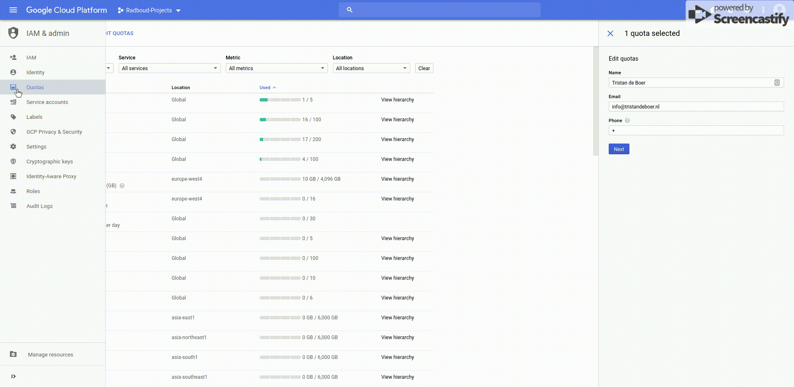

# GoogleCloudPlatform
This document will guide you to running deep neural network libraries on the Google Cloud Platform. It was specifically designed for [Machine Learning in Practise](https://www.ru.nl/prospectus/socsci/courses-osiris/ai/nwi-imc030-machine-learning-practice/), a course given at the Radboud University. We will guide you trough the following steps:
* Upgrading the GPU quota
* Installing your first Virtual Machine (VM)
* Installing all required packages (Jupyter Notebook, Tensorflow, Keras, CUDA Toolkit, cuDNN)

Please note that:
* You are responsible for your own budget.
* You _need_ to shut down VMs if you don't need them.
* This guide was designed for running machines in `us-west1`, as those machines are the cheapest.

## Upgrading the GPU quota
By default, the GPU quota is set to 0. 
1. Go to [IAM Quotas](https://console.cloud.google.com/iam-admin/quotas)
2. Use the filter to search for `NVIDIA P100 GPUs` in `us-west1`. 
3. Check the selectbox and click `Edit Quotas` (top left).
4. Enter your contact information and set the new quota limit.

